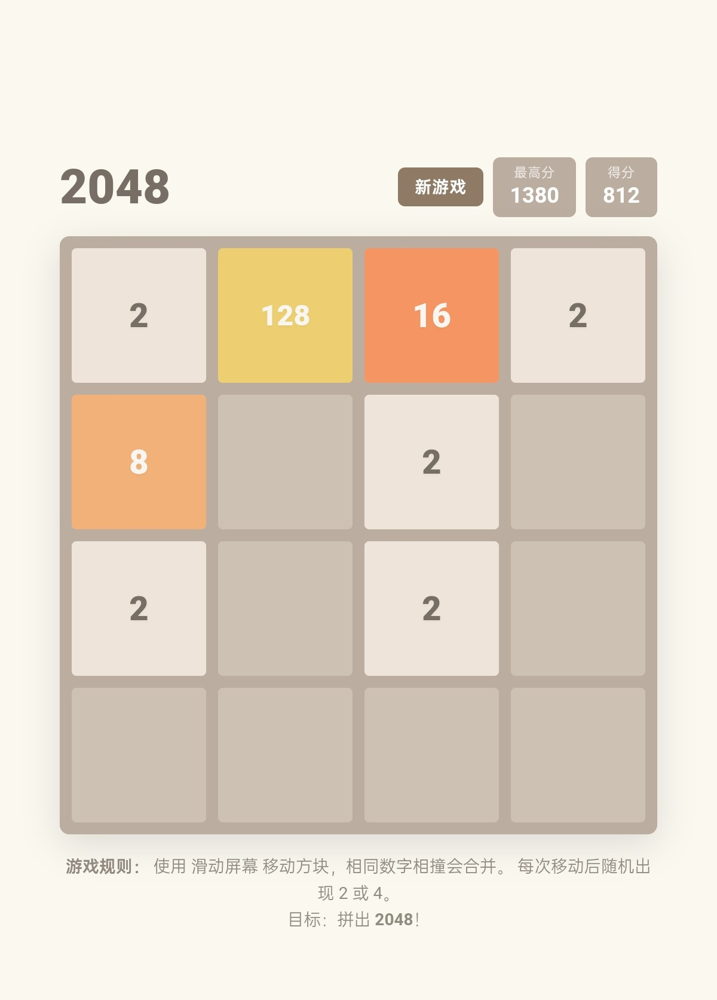

2048 Puzzle Game (v1.0.0)

🎮 欢迎体验这款经典的 2048 数字合并游戏！本项目是一个完全基于原生 HTML、CSS 和 JavaScript 开发的轻量级 Web 应用。无需任何外部依赖，打开即玩。代码已开源，遵循 **MIT License**。

> 🌐 **在线试玩 (Live Demo)**：  
> [https://yang-2026-user.github.io/My-Repository/Project/Game/2048/index.html](https://yang-2026-user.github.io/My-Repository/Project/Game/2048/)  
>

> 🌐 **游戏截图 (Game screenshot)**
>

---

## ✨ 核心特性 (Key Features)

- **极简交互与视觉 (Minimalist Design)**：还原了经典的米色风格 UI，卡片动画平滑，支持移动端和桌面端自适应。
- **双端操控 (Dual Controls)**：
  - 💻 **PC端**：支持键盘方向键 (`↑`, `↓`, `←`, `→`) 操控。
  - 📱 **移动端**：完美支持触摸滑动 (Touch Swipe)，并已禁用页面滚动以提升游戏体验。
- **智能计分系统 (Smart Scoring)**：实时更新当前得分与最高分 (Best Score)，并使用 `localStorage` 在本地自动保存您的最高纪录。
- **游戏状态管理**：包含自动检测“游戏结束 (Game Over)”与“达成 2048 胜利 (Victory)”的机制，并配有友好的弹窗提示。
- **开源与版权 (Open Source)**：基于 MIT License 发布，欢迎 Fork、学习或二次开发。

---

## 🚀 如何本地运行 (How to Run Locally)

由于这是一个纯前端的 Web 项目，您甚至不需要搭建复杂的服务器。最简单的运行方式如下：

1. **克隆仓库** 到您的本地机器：
   ```bash
   git clone https://github.com/Yang-2026-user/My-Repository.git
   ```
2. 进入项目目录：
   ```bash
   cd My-Repository/Project/Game/2048
   ```
3. 双击 **`index.html`** 文件，它将在您的默认浏览器中直接打开并运行。

> 💡 **提示**：若需在移动设备上测试，您可以使用 VS Code 的 **Live Server** 插件，或使用 `python -m http.server` 启动一个简单的本地服务，然后通过局域网访问。

---

## 📂 项目结构 (Project Structure)

```text
2048/
├── index.html          # 主入口文件：包含 HTML, CSS 样式和游戏核心 JS 逻辑
├── README.md           # 项目说明文档 (您正在阅读的此文件)
└── (其他文件夹)        # 项目根目录可能包含的其他模块
```

---

## 🛠️ 技术栈 (Tech Stack)

- **HTML5** - 页面结构
- **CSS3** (Flexbox/Grid) - 响应式布局与精美动画
- **Vanilla JavaScript (ES6)** - 核心游戏逻辑 (无任何第三方库或框架)

---

## 📝 致谢 (Acknowledgments)

- 感谢 **Gabriele Cirulli** 创造的经典 2048 游戏，为无数开发者带来了灵感与乐趣。  
  *(Thanks to Gabriele Cirulli for creating the classic 2048 game, inspiring countless developers with fun and creativity.)*

- 感谢所有为开源社区贡献力量的开发者，正是你们的无私奉献让技术生态如此繁荣。  
  *(Thanks to all developers who contribute to the open-source community. Your selfless dedication makes our tech ecosystem so vibrant.)*

---

## 📄 许可 (License)

本项目遵循 **MIT License** 开源协议。您可以在遵守许可证条款的前提下，免费使用、修改和分发本项目的代码。详情请查阅仓库根目录下的 `LICENSE` 文件。

---

**Enjoy the game! 祝您拼出 2048！🎉**
