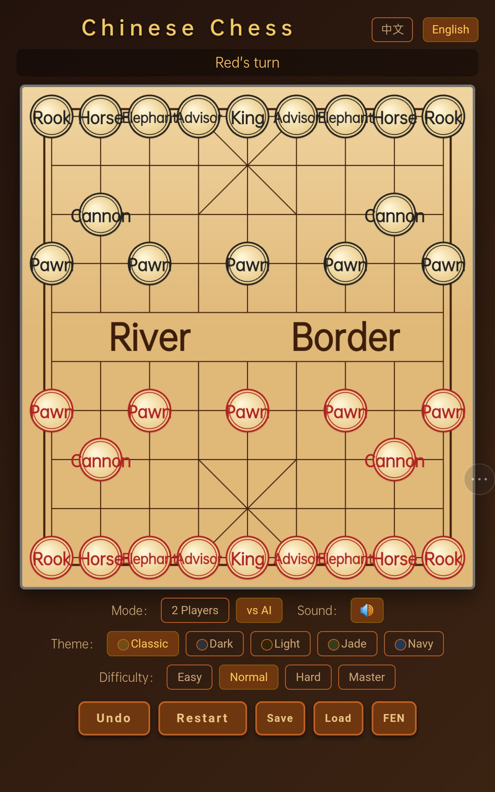

# 中国象棋 (Chinese Chess) v5.1

一个功能丰富、可直接在浏览器中运行的中国象棋游戏，支持人机对战、双人对战、多级 AI 难度、主题切换及棋局管理。



[👉 在线试玩](https://yang-2026-user.github.io/My-Repository/Project/Game/Xiangqi/)

## ✨ 主要特性

*   **两种对战模式**：
    *   **双人对战 (PvP)**：两位玩家轮流在同一设备上对弈。
    *   **人机对战 (PvAI)**：与 AI 电脑对战，AI 提供 4 级难度可选（简单、普通、困难、大师）。
*   **智能 AI 对手**：AI 采用 Negamax 搜索算法，结合 Alpha-Beta 剪枝、置换表、杀手走法、空着裁剪和静态搜索，在“大师”难度下具备较强的棋力。
*   **5 套精美主题**：内置经典、暗黑、明亮、翡翠、海军 5 套配色方案，可根据喜好自由切换，主题偏好会自动保存在浏览器中。
*   **完整棋局管理**：
    *   **悔棋**：支持悔一步棋（人机模式下需 AI 同意）。
    *   **保存/加载**：可将当前棋局保存到浏览器本地，随时加载继续对弈。
    *   **FEN 导入/导出**：支持导出标准 FEN 格式棋局记录，也可导入合法的 FEN 字符串快速恢复特定局面。
*   **音效反馈**：走子、吃子、被将军、胜负判定均有对应的音效提示，增强对弈沉浸感。
*   **多语言支持**：界面内置中文和英文两种语言，可一键切换。
*   **响应式设计**：完美适配桌面端和移动端，在手机和平板上也能流畅操作。

## 🚀 快速开始

### 在线游玩
直接访问项目的 [GitHub Pages 页面](https://yang-2026-user.github.io/My-Repository/Project/Game/Xiangqi/) 即可开始游戏。

### 本地运行
1.  克隆或下载本仓库到本地。
2.  由于这是一个纯前端项目，不需要任何构建工具，直接双击 `index.html` 文件即可在浏览器中打开游玩。

## 🎮 游戏指南

1.  **模式选择**：点击“双人对战”或“人机对战”切换模式。
2.  **走子**：**点击**一个己方棋子，再**点击**高亮显示的合法目标格即可走子。
3.  **AI 难度**：在人机模式下，可选择“简单”至“大师” 4 档难度。
4.  **主题切换**：在“主题”区域点击色块即可切换画风。
5.  **高级功能**：
    *   **FEN**：点击“FEN”按钮可展开面板，查看当前局面的 FEN 串，支持一键复制、下载为 `.fen` 文件或导入其他 FEN 串。
    *   **存档**：点击“保存”可存储当前对局，点击“加载”可恢复。

## 🗂️ 项目结构

```

My-Repository/
└── Project/
└── Game/
└── index.html   # 完整游戏代码（HTML + CSS + JavaScript）

```

## 🛠️ 技术实现

*   **纯前端**：所有代码集成在一个 `index.html` 文件中，无需任何外部依赖。
*   **AI 算法**：
    *   基于 **Negamax 框架** 的博弈树搜索。
    *   **Alpha-Beta 剪枝** 优化搜索效率。
    *   **置换表 (Transposition Table)** 缓存已搜索局面。
    *   **杀手走法 (Killer Move)** 与 **历史启发 (History Heuristic)** 优化走法排序。
    *   **静态搜索 (Quiescence Search)** 减少“水平效应”。
    *   **空着裁剪 (Null-Move Pruning)** 加速搜索。
*   **数据持久化**：使用 `localStorage` 保存主题偏好和棋局存档。
*   **FEN 支持**：支持标准 FEN 格式的导入与导出，方便棋局记录与分享。

## 🤝 贡献

欢迎提出 Issue 或 Pull Request 来帮助改进这个项目。

1.  Fork 本仓库
2.  创建你的特性分支 (`git checkout -b feature/AmazingFeature`)
3.  提交你的更改 (`git commit -m 'Add some AmazingFeature'`)
4.  推送到分支 (`git push origin feature/AmazingFeature`)
5.  打开一个 Pull Request

## 📄 许可证

本项目采用 MIT 许可证。详情请见 [LICENSE](LICENSE) 文件。
